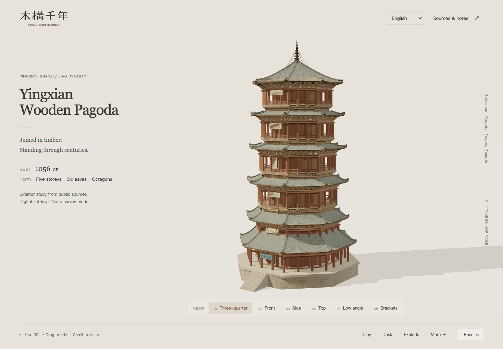
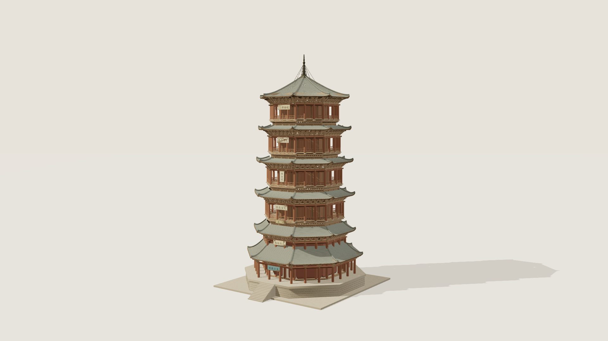
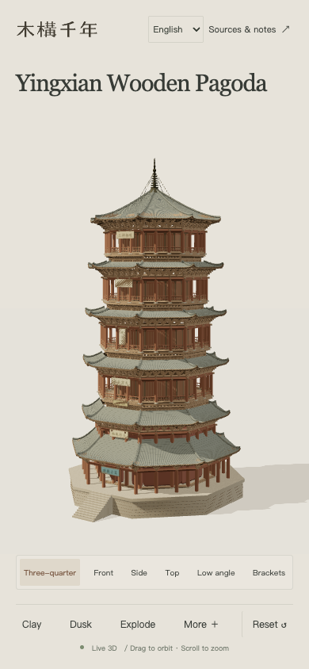

# Wooden Millennium · Yingxian Wooden Pagoda

An interactive real-time 3D exhibition study of the Yingxian Wooden Pagoda. Built with Vite, TypeScript, and Three.js. The project is a source-backed exterior visual reconstruction; it is not a survey, restoration, or structural engineering model.

**Live website:** [mugou-qiannian-yingxian.pages.dev](https://mugou-qiannian-yingxian.pages.dev/)

The interface is available in Simplified Chinese, Traditional Chinese, and English:

- `/?lang=zh-CN`
- `/?lang=zh-TW`
- `/?lang=en`

## Screenshots







## Run locally

Requires Node.js 22.12 or newer.

```sh
npm ci
npm run dev
```

Open `http://127.0.0.1:5173/`. Use `/?clay` to start in the white-model view.

```sh
npm run build
npm run preview -- --host 127.0.0.1 --port 4173
```

## Interaction

- Drag to orbit; use the wheel or pinch gesture to zoom.
- Use the six camera presets: three-quarter, front, side, top, low angle, and bracket detail.
- Switch between material and white-model views, daylight and dusk, and the presentation-only floor separation.
- The scene is static by default. “More” enables a slow orbit; manual interaction pauses it.
- Reset restores the material, daylight, assembled state, default camera, and device quality.
- Hide the interface for a clean view. Export a 3840×2160 or 1920×1080 PNG without the interface.

## Architecture

- `src/config.ts` — centralized architectural parameters, floor/eave definitions, seed, and source index.
- `src/geometry.ts` — platform, timber frame, galleries, railings, bracket sets, curved roofs, and finial.
- `src/materials.ts` — procedural weathered timber, stone, grey tile, and white-model materials.
- `src/environment.ts` — exhibition ground, daylight/dusk lighting, and shadow settings.
- `src/camera.ts` — bounding-box-based camera presets and export framing.
- `src/export.ts` — off-screen export, capability checks, and resource cleanup.
- `src/ui.ts`, `src/style.css`, `src/layout.css` — exhibition label interface and responsive layout.
- `docs/REFERENCES.md` — references, measurement tiers, conflicts, and floor correspondence.
- `docs/VALIDATION.md` — tested environments, checks, and known limitations.

## Research scope

The model uses public institutional, academic, and photographic references to establish the overall octagonal plan, five visible storeys, six eave levels, gallery rhythm, roof sequence, and finial. Dimensions are separated into sourced values, image-based estimates, and unknowns. Detailed floor geometry, joinery, roof curves, plaques, and weathering remain editable visual approximations.

The model includes no hidden complete interior, complete joinery system, or claimed present-day deformation. It must not be used for conservation, measurement, restoration, or structural decisions.

## Validation

```sh
npx playwright install chromium
node artifacts/check.mjs
node artifacts/validate.mjs
```

Keep the local development server running in another terminal. The browser checks cover the three languages, camera state, responsive layout, export flow, and key interaction states. Performance observations are specific to the test machine and browser.

## License

Source code is released under the license in `LICENSE`. The model uses procedural materials and locally bundled assets; no third-party image hotlinks or paid AI modeling services are required.
